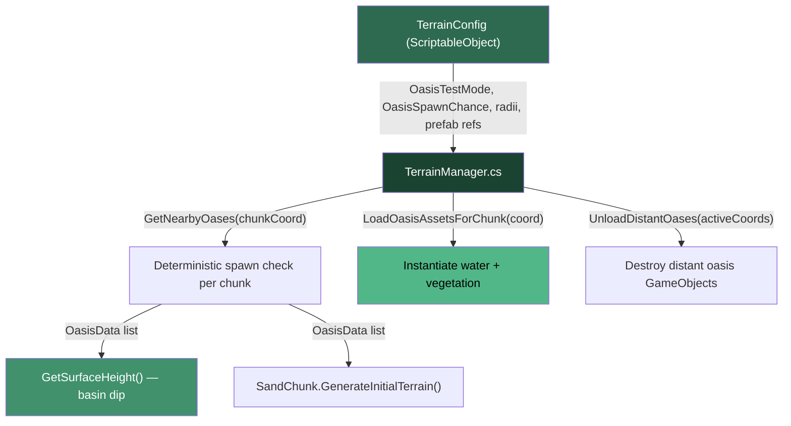
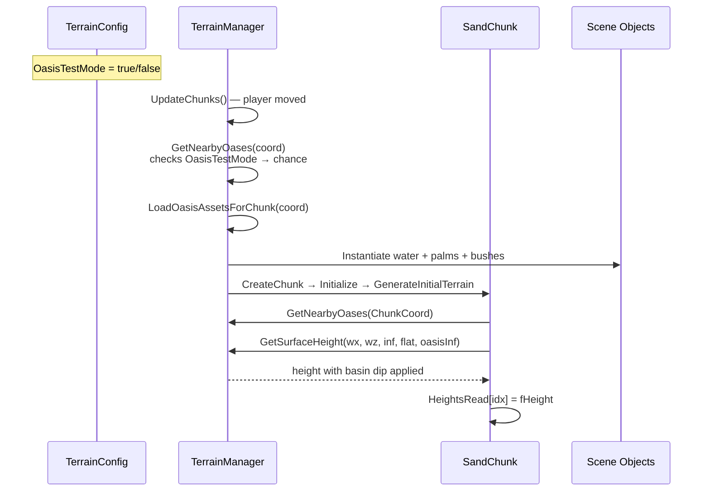

# Procedural Oasis Feature — Detailed Implementation Plan

## Overview

Add a rare procedural oasis to the desert. The oasis creates a **concave basin** in the terrain, fills it with the **Water Specular Mirror** prefab, and clusters **palm trees and bushes** around the rim. A **Test Mode** boolean lets you force every chunk to spawn an oasis for quick iteration.

> [!IMPORTANT]
> **No new scripts are created.** All oasis logic is embedded directly into the existing `TerrainManager.cs`, following the same pattern as mountains and plants.

---

## Architecture Diagram



---

## File Changes

### 1. [MODIFY] [TerrainConfig.cs](file:///c:/Users/LENOVO%20IDEAPAD/Desert_raw-main/Assets/Scripts/TerrainConfig.cs)

**Location:** After line 178 (after `MountainSpeedMultiplier`), before the closing `}`.

Add these fields:

```csharp
[Header("Oasis")]
[Tooltip("IF TRUE, every chunk spawns an oasis (for testing). Set FALSE for production.")]
public bool OasisTestMode = false;

[Tooltip("Probability of an oasis spawning per chunk (used when OasisTestMode is false).")]
public float OasisSpawnChance = 0.0001f;

[Tooltip("Total radius of the oasis basin (outer edge where sand starts dipping).")]
public float OasisBasinRadius = 100.0f;

[Tooltip("Radius of the water surface plane (must be < OasisBasinRadius).")]
public float OasisWaterRadius = 50.0f;

[Tooltip("Maximum depth of the basin dip below normal terrain height.")]
public float OasisBasinDepth = 12.0f;

[Tooltip("Radius around PlayerSpawnPoint where oases will NOT spawn.")]
public float OasisSafeRadius = 300.0f;

[Header("Oasis Assets")]
public GameObject OasisWaterPrefab;

public List<string> OasisPalmPrefabPaths = new List<string> {
    "Assets/for_oasis/otree/Palm 1.prefab",
    "Assets/for_oasis/otree/Palm 2.prefab",
    "Assets/for_oasis/otree/Palm 3.prefab",
    "Assets/for_oasis/otree/Palm 4.prefab"
};

public List<string> OasisBushPrefabPaths = new List<string> {
    "Assets/for_oasis/obush/Bush 1.prefab",
    "Assets/for_oasis/obush/Bush 2.prefab",
    "Assets/for_oasis/obush/Bush 3.prefab",
    "Assets/for_oasis/obush/Bush 4.prefab"
};

[System.NonSerialized] public List<GameObject> LoadedOasisPalmPrefabs = new List<GameObject>();
[System.NonSerialized] public List<GameObject> LoadedOasisBushPrefabs = new List<GameObject>();
```

**Field explanations:**

| Field | Type | Default | Purpose |
|---|---|---|---|
| `OasisTestMode` | `bool` | `false` | When `true`, spawn chance becomes 1.0 — every chunk gets an oasis |
| `OasisSpawnChance` | `float` | `0.0001` | 0.01% chance per chunk in production |
| `OasisBasinRadius` | `float` | `100` | The full concave area extent (meters) |
| `OasisWaterRadius` | `float` | `50` | Where the water plane sits (inner flat area) |
| `OasisBasinDepth` | `float` | `12` | Max height subtraction at basin center |
| `OasisSafeRadius` | `float` | `300` | No-spawn zone around player start |

**Available assets in `Assets/for_oasis/`:**
- `Water Specular Mirror.prefab` — the water surface
- `otree/Palm 1..4.prefab` — palm trees (also Tree 1..5, Рalm 1..8 with Cyrillic Р)
- `obush/Bush 1..12.prefab` — bushes

---

### 2. [MODIFY] [TerrainManager.cs](file:///c:/Users/LENOVO%20IDEAPAD/Desert_raw-main/Assets/Scripts/TerrainManager.cs)

This is the main integration point. Four additions:

#### 2A. Data Structure (add after line 38, after `_currentChunkCoord`)

```csharp
// ── Oasis Management ──
public struct OasisData
{
    public Vector2 position;      // World XZ center of the oasis
    public float basinRadius;     // Outer edge of the concave dip
    public float waterRadius;     // Radius of the water plane
    public float basinDepth;      // Max depth of the dip
}

private Dictionary<Vector2Int, List<GameObject>> _activeOasisAssets 
    = new Dictionary<Vector2Int, List<GameObject>>();
```

#### 2B. Deterministic Oasis Query (new method, add in an `#region Oasis` block)

This is the **core spawning decision**. It uses the same `Random.InitState(Seed + hash)` pattern as `MountainSpawner`. The **Test Mode toggle** overrides the chance to 1.0:

```csharp
#region Oasis Logic

/// <summary>
/// Returns all oases that could influence the given chunk coordinate.
/// Searches a radius of nearby chunks because an oasis basin can span
/// multiple chunks.
/// </summary>
public List<OasisData> GetNearbyOases(Vector2Int targetCoord)
{
    List<OasisData> result = new List<OasisData>();
    if (Config == null) return result;

    float chunkSizeWorld = GetChunkSizeWorld();
    // How many chunks away can an oasis basin reach?
    int searchRadius = Mathf.CeilToInt(Config.OasisBasinRadius / chunkSizeWorld) + 1;

    for (int y = -searchRadius; y <= searchRadius; y++)
    {
        for (int x = -searchRadius; x <= searchRadius; x++)
        {
            Vector2Int coord = targetCoord + new Vector2Int(x, y);

            // Save & restore Random state so we don't corrupt other systems
            Random.State oldState = Random.state;
            // Deterministic hash for this chunk (different multipliers than mountains)
            Random.InitState(Config.Seed + coord.x * 54321 + coord.y * 98765);

            // ★ TEST MODE TOGGLE ★
            float chance = Config.OasisTestMode ? 1.0f : Config.OasisSpawnChance;

            if (Random.value < chance)
            {
                // Oasis center = chunk center
                float worldX = coord.x * chunkSizeWorld + chunkSizeWorld * 0.5f;
                float worldZ = coord.y * chunkSizeWorld + chunkSizeWorld * 0.5f;

                // Reject if too close to player spawn
                Vector3 pos3D = new Vector3(worldX, 0, worldZ);
                if (Vector3.Distance(pos3D, Config.PlayerSpawnPoint) >= Config.OasisSafeRadius)
                {
                    result.Add(new OasisData {
                        position = new Vector2(worldX, worldZ),
                        basinRadius = Config.OasisBasinRadius,
                        waterRadius = Config.OasisWaterRadius,
                        basinDepth = Config.OasisBasinDepth
                    });
                }
            }

            Random.state = oldState;
        }
    }
    return result;
}
```

**Key design decisions:**
- `Random.InitState(Seed + coord.x * 54321 + coord.y * 98765)` — unique multipliers so oases don't overlap with mountain or stone spawn decisions
- `searchRadius` calculated from `OasisBasinRadius / chunkSizeWorld` so that a large basin spanning 2+ chunks still gets detected
- Safe zone check uses existing `Config.PlayerSpawnPoint` and `Config.OasisSafeRadius`

#### 2C. Asset Loading & Unloading (new methods in the `#region Oasis` block)

```csharp
/// <summary>
/// If this chunk has an oasis, instantiate the water plane + vegetation.
/// Called from UpdateChunks alongside MountainSpawner/PlantSpawner.
/// </summary>
public void LoadOasisAssetsForChunk(Vector2Int coord)
{
    if (_activeOasisAssets.ContainsKey(coord)) return; // Already loaded
    
    Random.State oldState = Random.state;
    Random.InitState(Config.Seed + coord.x * 54321 + coord.y * 98765);

    float chance = Config.OasisTestMode ? 1.0f : Config.OasisSpawnChance;
    if (Random.value < chance)
    {
        float chunkSizeWorld = GetChunkSizeWorld();
        float worldX = coord.x * chunkSizeWorld + chunkSizeWorld * 0.5f;
        float worldZ = coord.y * chunkSizeWorld + chunkSizeWorld * 0.5f;
        Vector3 center = new Vector3(worldX, 0, worldZ);

        // Respect safe zone
        if (Vector3.Distance(center, Config.PlayerSpawnPoint) < Config.OasisSafeRadius)
        {
            Random.state = oldState;
            return;
        }

        List<GameObject> assets = new List<GameObject>();

        // ── Water Plane ──
        if (Config.OasisWaterPrefab != null)
        {
            // Place water at BaseHeight (the "sea level" of the basin)
            Vector3 waterPos = new Vector3(worldX, Config.BaseHeight, worldZ);
            GameObject water = Instantiate(Config.OasisWaterPrefab, waterPos, Quaternion.identity, transform);
            
            // Scale the water plane to match OasisWaterRadius
            float diameter = Config.OasisWaterRadius * 2f;
            water.transform.localScale = new Vector3(diameter, 1f, diameter);
            assets.Add(water);
        }

        // ── Palm Trees (near the rim, outside water) ──
        int palmCount = Random.Range(4, 8);
        for (int i = 0; i < palmCount; i++)
        {
            float angle = Random.Range(0f, Mathf.PI * 2f);
            // Place between water edge and basin edge
            float dist = Random.Range(Config.OasisWaterRadius + 5f, Config.OasisWaterRadius + 20f);
            Vector3 pos = center + new Vector3(Mathf.Cos(angle) * dist, 0, Mathf.Sin(angle) * dist);
            pos.y = SampleHeight(pos);  // Sit on the terrain

            if (Config.LoadedOasisPalmPrefabs.Count > 0)
            {
                GameObject palm = Instantiate(
                    Config.LoadedOasisPalmPrefabs[Random.Range(0, Config.LoadedOasisPalmPrefabs.Count)],
                    pos, Quaternion.Euler(0, Random.Range(0, 360f), 0), transform);
                palm.transform.localScale = Vector3.one * Random.Range(1.5f, 3.0f);
                assets.Add(palm);
            }
        }

        // ── Bushes (denser ring around the water) ──
        int bushCount = Random.Range(10, 20);
        for (int i = 0; i < bushCount; i++)
        {
            float angle = Random.Range(0f, Mathf.PI * 2f);
            float dist = Random.Range(Config.OasisWaterRadius + 2f, Config.OasisWaterRadius + 25f);
            Vector3 pos = center + new Vector3(Mathf.Cos(angle) * dist, 0, Mathf.Sin(angle) * dist);
            pos.y = SampleHeight(pos);

            if (Config.LoadedOasisBushPrefabs.Count > 0)
            {
                GameObject bush = Instantiate(
                    Config.LoadedOasisBushPrefabs[Random.Range(0, Config.LoadedOasisBushPrefabs.Count)],
                    pos, Quaternion.Euler(0, Random.Range(0, 360f), 0), transform);
                bush.transform.localScale = Vector3.one * Random.Range(0.8f, 1.6f);
                assets.Add(bush);
            }
        }

        _activeOasisAssets[coord] = assets;
    }

    Random.state = oldState;
}

/// <summary>
/// Destroy oasis assets for chunks that are no longer in the active set.
/// </summary>
public void UnloadDistantOases(HashSet<Vector2Int> activeCoords)
{
    List<Vector2Int> toRemove = new List<Vector2Int>();
    foreach (var coord in _activeOasisAssets.Keys)
    {
        if (!activeCoords.Contains(coord))
            toRemove.Add(coord);
    }
    foreach (var coord in toRemove)
    {
        foreach (var go in _activeOasisAssets[coord])
        {
            if (go != null) Destroy(go);
        }
        _activeOasisAssets.Remove(coord);
    }
}

#endregion
```

**Vegetation placement diagram:**
```
         BasinRadius (100m)
        ┌───────────────────┐
        │                   │
        │   WaterRadius     │
        │  ┌──────────┐    │
        │  │  WATER    │    │
        │  │  (50m)    │    │
        │  └──────────┘    │
        │ 🌴🌿 Vegetation  │  ← Plants spawn HERE (50m–75m from center)
        │    Ring           │
        └───────────────────┘
           Dunes resume
```

#### 2D. Height Modification (modify existing `GetSurfaceHeight` — line 454)

**Current signature:**
```csharp
public float GetSurfaceHeight(float worldX, float worldZ, float mountainInfluence = 0f, float flatness = 0f)
```

**New signature — add `oasisInfluence` parameter:**
```csharp
public float GetSurfaceHeight(float worldX, float worldZ, float mountainInfluence = 0f, float flatness = 0f, float oasisInfluence = 0f)
```

**At the end of the method (before the `return` on line 503), add the basin dip:**
```csharp
// ── Oasis Basin Dip ──
// oasisInfluence is 0 (outside basin) to 1 (at basin center)
// SmoothStep ensures a gradual, natural-looking bowl shape
float oasisDip = oasisInfluence * Config.OasisBasinDepth;

float h = Config.BaseHeight + finalNoiseHeight + pileUpHeight - oasisDip;
return Mathf.Max(h, -Config.BottomDepth + 1f);  // Don't go below geometry floor
```

**Height profile cross-section:**
```
  Normal terrain       Basin edge        Basin center        Basin edge       Normal terrain
       ___                 ___                                    ___               ___
      /   \               /   \                                  /   \             /   \
  ~~~/ dune \~~~~~~~~~~~~~╱     ╲──────────────────────────────╱     ╲~~~~~~~~~~~~~/ dune \~~~
                          │     │     W A T E R   L E V E L    │     │
                          │     ╲____________________________ ╱     │
                          │          oasisDip = 12m                  │
                          │◄────── OasisBasinRadius = 100m ────────►│
                                  │◄─ WaterRadius = 50m ──►│
```

#### 2E. Wire into `UpdateChunks()` (modify existing code around lines 228–248)

Add `LoadOasisAssetsForChunk(coord)` calls alongside `MountainSpawner` and `PlantSpawner`, and add `UnloadDistantOases(mountainCoords)`:

```csharp
// Inside the foreach (var coord in mountainCoords) loops:
LoadOasisAssetsForChunk(coord);

// After the unload calls:
UnloadDistantOases(mountainCoords);
```

#### 2F. Wire into `SampleHeight()` (modify existing code around line 442)

Add oasis influence calculation before the return:

```csharp
// After getting mountainInfluence...
float oasisInf = 0f;
var oases = GetNearbyOases(new Vector2Int(pX, pZ));
foreach (var o in oases)
{
    float d = Vector2.Distance(new Vector2(worldPos.x, worldPos.z), o.position);
    if (d < o.basinRadius)
    {
        float t = 1.0f - (d / o.basinRadius);
        oasisInf = Mathf.Max(oasisInf, Mathf.SmoothStep(0f, 1f, t));
    }
}
return GetSurfaceHeight(worldPos.x, worldPos.z, influence, flatness, oasisInf);
```

#### 2G. Prefab Loading in `Start()` (add new method)

Load oasis prefabs using `AssetDatabase` (Editor) since the existing system uses string paths:

```csharp
void Start()
{
    if (Config == null) return;

#if UNITY_EDITOR
    if (Config.OasisWaterPrefab == null)
        Config.OasisWaterPrefab = UnityEditor.AssetDatabase.LoadAssetAtPath<GameObject>(
            "Assets/for_oasis/Water Specular Mirror.prefab");

    if (Config.LoadedOasisPalmPrefabs.Count == 0)
    {
        foreach (var path in Config.OasisPalmPrefabPaths)
        {
            var prefab = UnityEditor.AssetDatabase.LoadAssetAtPath<GameObject>(path);
            if (prefab != null) Config.LoadedOasisPalmPrefabs.Add(prefab);
        }
    }

    if (Config.LoadedOasisBushPrefabs.Count == 0)
    {
        foreach (var path in Config.OasisBushPrefabPaths)
        {
            var prefab = UnityEditor.AssetDatabase.LoadAssetAtPath<GameObject>(path);
            if (prefab != null) Config.LoadedOasisBushPrefabs.Add(prefab);
        }
    }
#endif
}
```

---

### 3. [MODIFY] [SandChunk.cs](file:///c:/Users/LENOVO%20IDEAPAD/Desert_raw-main/Assets/Scripts/SandChunk.cs)

**Location:** `GenerateInitialTerrain()` method (line 182–255).

Currently at **line 231**, the height is sampled:
```csharp
float fHeight = TerrainManager.Instance.GetSurfaceHeight(wx, wz, maxInf, flatness);
```

**Change to also pass oasis influence:**
```csharp
// ── Oasis basin influence ──
float oasisInf = 0f;
var nearbyOases = TerrainManager.Instance.GetNearbyOases(ChunkCoord);
foreach (var o in nearbyOases)
{
    float d = Vector2.Distance(pos, o.position);  // pos is already Vector2(wx, wz)
    if (d < o.basinRadius)
    {
        float t = 1.0f - (d / o.basinRadius);
        oasisInf = Mathf.Max(oasisInf, Mathf.SmoothStep(0f, 1f, t));
    }
}

float fHeight = TerrainManager.Instance.GetSurfaceHeight(wx, wz, maxInf, flatness, oasisInf);
```

> [!TIP]
> For performance, the `GetNearbyOases` call should be hoisted **outside** the double for-loop (it only depends on `ChunkCoord`, not per-vertex). Store the result in a local variable before the loop.

---

## Data Flow Summary



---

## Test Mode Workflow

| Step | Action | Expected Result |
|------|--------|----------------|
| 1 | In Unity Inspector, select the **TerrainConfig** asset | See the new "Oasis" section |
| 2 | Check **Oasis Test Mode** ☑ | `OasisTestMode = true` |
| 3 | Assign `Water Specular Mirror.prefab` to **OasisWaterPrefab** slot | Water prefab linked |
| 4 | Press **Play** | Every chunk (outside safe radius) spawns an oasis |
| 5 | Walk to nearest chunk boundary | See concave basin, water plane, palm trees, bushes |
| 6 | Uncheck **Oasis Test Mode** ☐ | `OasisTestMode = false` |
| 7 | Press **Play** again | Oases appear with 0.01% probability per chunk |

---

## Verification Plan

### Visual Checks
- Basin creates a smooth concave dip (no sharp edges)
- Water plane sits at `BaseHeight` inside the dip
- Palm trees stand on the rim above water level (not submerged)
- Bushes cluster around the water edge
- Sand simulation doesn't fill the basin back up (procedural override persists)

### Edge Cases
- Oasis near chunk boundary: basin extends correctly across chunks
- Oasis near mountain: mountain influence and oasis dip don't conflict badly
- Multiple oases in adjacent chunks (test mode): no overlapping asset issues
- Chunk unload/reload: oasis assets are correctly destroyed and re-created

### Performance
- `GetNearbyOases` is called per-chunk not per-vertex in the hot path
- In test mode with many oases, frame rate should remain stable
